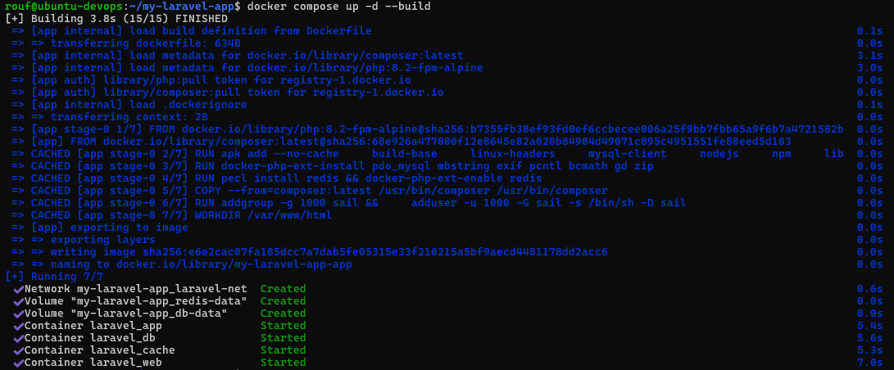
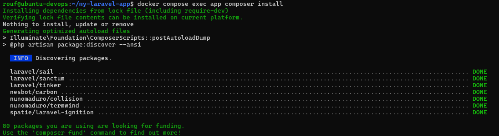
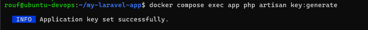
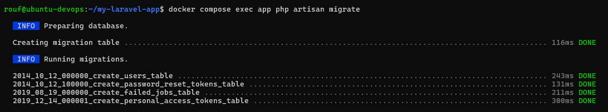
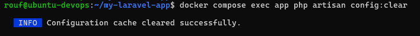
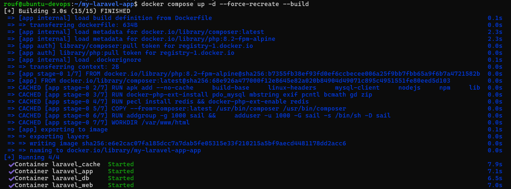
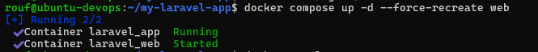
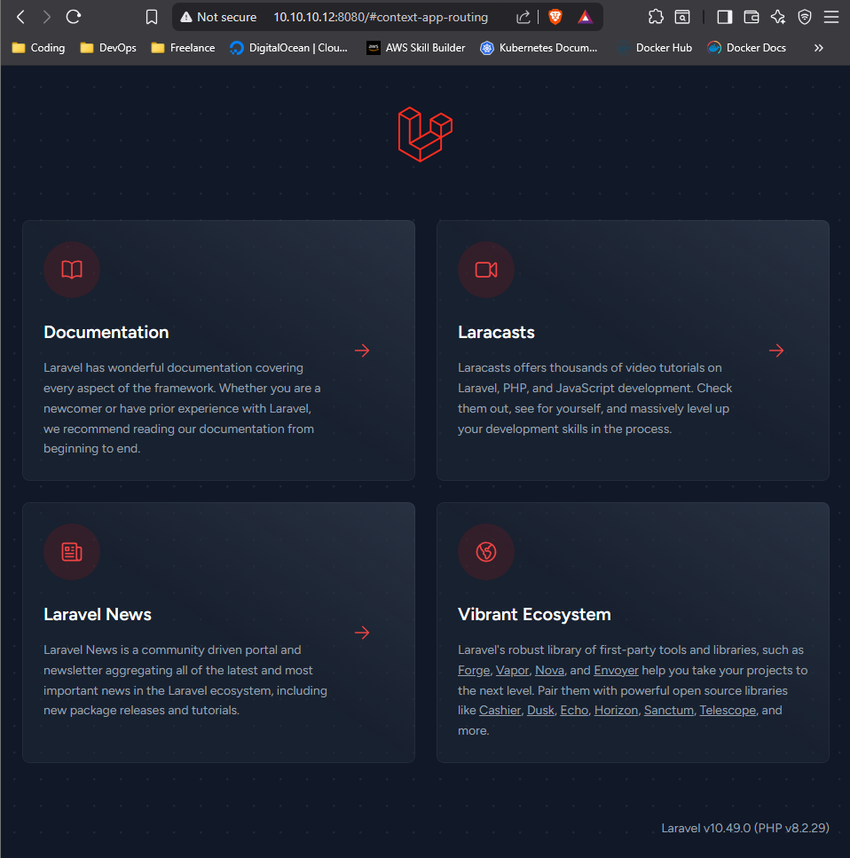

# MINI PROJECT LARAVEL DOCKER
## Menjalankan aplikasi laravel modern di atas Docker menggunakan Nginx, MySQL, Dan Redis

## Skenario Project & Arsitektur
- Menjalankan 4 kontainer utama yang berkerja sama:
1. Nginx (web): Bertindak sebagai Web server. Semua permintaan dari pengguna akan masuk ke sini.Jika permintaan untuk file statis contoh html, css, js, foto.Nginx akan langsung melayaninya jika permintaan untuk aplikasi PHP, Nginx akan meneruskannya ke container PHP-FPM

2. PHP_FPM (app): ini adalah container utama berisi aplikasi Laravel dan PHP.Container ini memproses logika aplikasi dan berkomunikasi dengan database MySQL dan Redis Caching session database.

3. MySQL (db): Container database untuk menyimpan semua data persisten aplikasi kita

4. Redis (cache): Container untuk caching dan session, mempercepat aplikasi dengan mengurangi beban ke database.

## Alur Request 
Pengguna --> web (Nginx) --> app (Laravel/PHP-FPM) --> db(MySQL) & cache (Redis)

## Pra-Syarat
1. Docker dan Docker compose
2. Composer
3. Proyek Laravel 

## Command menjalankan container

1. Jalankan Docker compose:
```bash
docker compose up -d --build
```


2. Install dependensi Laravel:
```bash
docker compose exec app composer install
```

3. Generate kunci aplikasi:
```bash
docker compose exec app php artisan key:generate 
```

4. Jalankan migrasi Database:
```bash
docker compose exec app php artisan migrate
```

5. Akses aplikasi di :
http://localhost:8080

6. Tadi saya mengalami error di bagian redis host dan sudah saya fix, lalu di terminal running command berikut
```bash
docker compose exec app php artisan config:clear
```


7. Saat trouble saya membenahi kodenya dan fix kode.Untuk membuat ulang container yang error, Running command berikut 
```bash
docker compose up -d --force-recreate
```


8. Untuk sebuah container 
```bash
docker compose up -d --force-recreate web
```


# HASIL AKHIR TEST DI BROWSER


## 🎯 Tujuan

Project ini dibuat untuk tujuan **pembelajaran**.
Feel free to modify and experiment 🚀